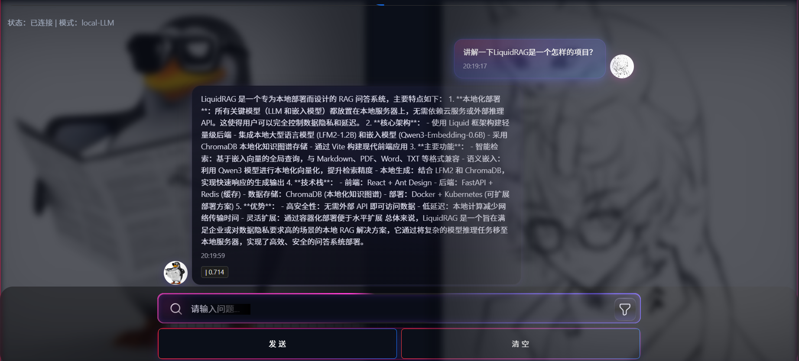

# LiquidRAG — 本地 RAG 交互系统（Windows 11）

LiquidRAG 是一个在 Windows 11 上优化的本地 RAG（检索增强生成）问答系统。它将本地 LLM（LFM2‑1.2B）与高质量嵌入模型（Qwen3‑Embedding‑0.6B）和本地向量库（ChromaDB）结合，实现“离线检索 + 生成”的完整闭环，不依赖任何外部推理 API。

## 功能特性
- 智能检索：基于嵌入向量的相似度搜索，支持 Markdown/PDF/Word/TXT
- 语义嵌入：Qwen3‑Embedding‑0.6B 本地化向量化，归一化与批量编码
- 本地生成：LFM2‑1.2B 本地推理，含 GPU 负载与生成性能监控
- 前端交互：基于 React + Ant Design 的对话界面与知识库管理
- 个性化背景：支持“AI/用户”两侧头像选择，半透明、淡入淡出融合深色背景
- 开发接口：FastAPI 提供标准 REST API（健康检查/提问/检索/文档管理/重建索引）

## 项目结构
```
LiquidRAG/
├─ frontend/react/           # 前端（Vite + React + AntD）
│  ├─ public/                # 静态资源（头像素材、images.json、avatar.json）
│  ├─ src/                   # 源码（App、样式、组件、Redux store 等）
│  └─ vite.config.js         # 开发服务与本地持久化路由
├─ backend/web_api/          # Web API（FastAPI）
│  ├─ api_server.py          # 核心接口封装（RAG 管线 + 文档管理）
│  └─ requirements.txt       # Web API 最小依赖集合
├─ scripts/                  # RAG 管线相关 Python 脚本
│  ├─ rag_pipeline.py        # 主流程：检索 + 生成 + 监控
│  ├─ embedding_model.py     # 嵌入模型封装（Sentence‑Transformers）
│  ├─ vector_store.py        # ChromaDB 持久化与检索
│  └─ document_loader.py     # 文档加载与分块（Markdown/PDF/Docx/Txt）
├─ configs/                  # 配置（RAGConfig 等）
│  └─ rag_config.py          # 目录、模型路径、检索/生成参数
├─ index/                    # 向量库持久化目录（ChromaDB 存储）
├─ models/                   # 本地 LLM/Embedding 模型目录（不随仓库分发）
└─ README.md                 # 项目说明
```

## 快速开始（开发）
1. 后端（开发态）：
   - 安装依赖：`pip install -r backend/web_api/requirements.txt`
   - 如遇 NumPy 2.x 兼容问题：`pip install "numpy<2"`
   - 启动：`uvicorn backend.web_api.api_server:app --host 127.0.0.1 --port 8000 --reload`
2. 前端（开发态）：
   - 进入前端目录：`cd frontend/react`
   - 启动：`npm run dev`（自动扫描并生成 `public/images.json`）
   - 预览：浏览器访问 `http://localhost:5173/`（若端口占用会自动切换）

## 前端说明
- 头像选择来源：将素材目录复制到 `frontend/react/public/head_portrait/`，启动时脚本会生成 `public/images.json`；选择结果持久化到 `public/avatar.json`。
- UI：
  - 顶部“个性化”入口，首次进入自动弹窗选择头像
  - 聊天区域滚动与底部输入区安全间距
  - 两侧背景融合（AI 左/用户右），半透明、模糊、边缘淡出

## 后端接口（节选）
- `GET /api/v1/health` 健康检查
- `GET /api/v1/status` 管线与 GPU 状态
- `POST /api/v1/ask` 问答（返回答案与来源）
- `GET /api/v1/retrieve` 仅检索来源
- `POST /api/v1/upload` 上传并写入向量库（占位实现，需结合 VectorStore）
- `GET /api/v1/documents` / `DELETE /api/v1/documents/{doc_id}` 文档列表/删除
- `POST /api/v1/documents/batch_delete` 批量删除
- `POST /api/v1/reindex` 重建索引（清空集合后重新加载源文档）

## 依赖与环境建议
- Python 3.10–3.12（建议 3.11）
- GPU 推荐：RTX 4060（8GB）或更高；CPU 模式亦可运行但性能较低
- 关键依赖：torch、transformers、sentence‑transformers、chromadb、numpy、PyPDF2、markdown、python‑docx、fastapi、uvicorn、pydantic、python‑multipart、send2trash

## 开源许可证
本项目采用 MIT 许可证发布。详见下述许可文本：

```
MIT License

Copyright (c) 2025 LiquidRAG Contributors

Permission is hereby granted, free of charge, to any person obtaining a copy
of this software and associated documentation files (the "Software"), to deal
in the Software without restriction, including without limitation the rights
to use, copy, modify, merge, publish, distribute, sublicense, and/or sell
copies of the Software, and to permit persons to whom the Software is
furnished to do so, subject to the following conditions:

The above copyright notice and this permission notice shall be included in all
copies or substantial portions of the Software.

THE SOFTWARE IS PROVIDED "AS IS", WITHOUT WARRANTY OF ANY KIND, EXPRESS OR
IMPLIED, INCLUDING BUT NOT LIMITED TO THE WARRANTIES OF MERCHANTABILITY,
FITNESS FOR A PARTICULAR PURPOSE AND NONINFRINGEMENT. IN NO EVENT SHALL THE
AUTHORS OR COPYRIGHT HOLDERS BE LIABLE FOR ANY CLAIM, DAMAGES OR OTHER
LIABILITY, WHETHER IN AN ACTION OF CONTRACT, TORT OR OTHERWISE, ARISING FROM,
OUT OF OR IN CONNECTION WITH THE SOFTWARE OR THE USE OR OTHER DEALINGS IN THE
SOFTWARE.
```

## 致谢
- LFM2‑1.2B 与 Qwen3‑Embedding‑0.6B 的开源社区
- ChromaDB 与 FastAPI 的优秀生态

## 维护与反馈
- 问题反馈：请提交 Issue，附详细日志与环境信息
- 功能建议：欢迎 PR，建议按模块划分提交